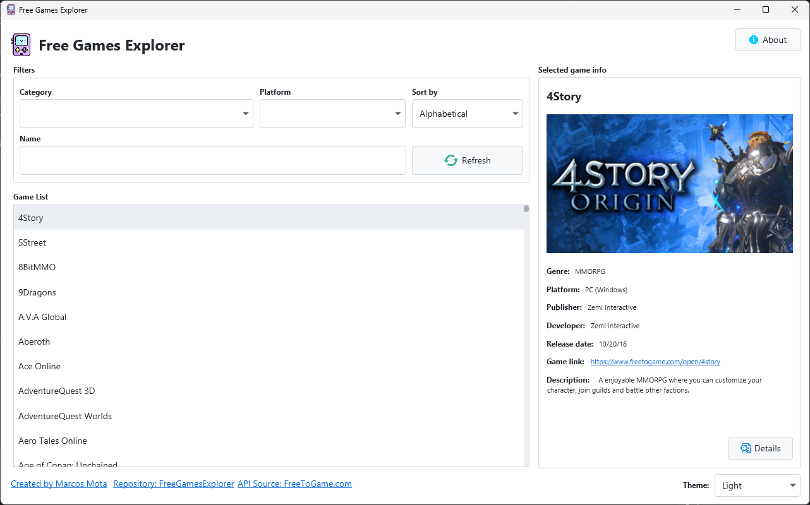
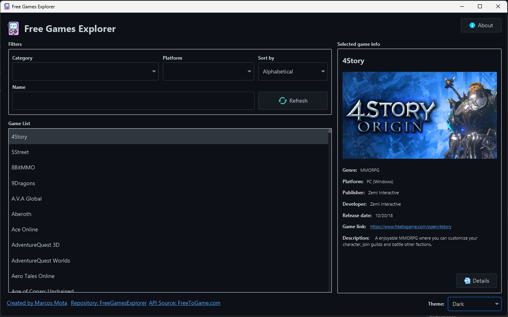
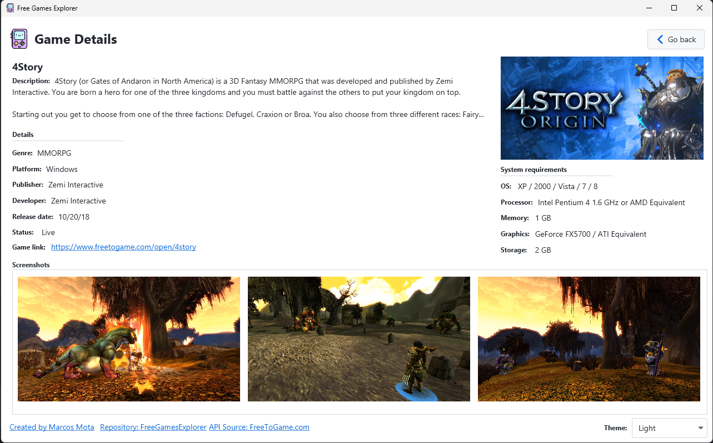

# Free Games Explorer

This is a repository of a JavaFX application created for an assignment, intended for learning purposes.

**Assignment Detail:** COMP1011 Assignment 2  
**Created on:** 2024-11-26

## Student Information

- **ID:** 200564426  
- **Name:** Marcos Oliveira Mota

## Description

Free Games Explorer is a Desktop app that enables users to explore many free games available in multiple platforms. The user has the option to see a list of games, filter with some criteria like category, platform or name, and see details and screenshots.

## Screenshots

### Home page (Light theme)

### Dark theme (Dark theme)

### Game details page

## Technologies Used

- **Java** - Main language
- **JavaFX** - Library for creating desktop apps
- **ControlsFX** - Library for some custom controls
- **AtlantaFX** - Library for applying modern light/dark themes

## Contact

Check my <a href="https://github.com/marcosmota5" title="Profile">profile</a> for contact information.

## Other

A bit thanks to <a href="https://www.freetogame.com/" title="Free to game">FreeToGame</a> for providing the free API that is used throgout this entire application.

Thanks to <a href="https://www.flaticon.com/" title="Flaticon">Flaticon</a> for providing for free so many amazing images. Every single icon in this project comes from Flaticon, so all icon rights are reserved to it. Below is the list of images from FlatIcon used in this app.

- <a href="https://www.flaticon.com/free-icons/landscape" title="landscape icons">Landscape icons created by mim_studio - Flaticon</a>
- <a href="https://www.flaticon.com/free-icons/refresh" title="refresh icons">Refresh icons created by Pixel Buddha - Flaticon</a>
- <a href="https://www.flaticon.com/free-icons/more-details" title="more details icons">More details icons created by hqrloveq - Flaticon</a>
- <a href="https://www.flaticon.com/free-icons/video-game" title="video-game icons">Video-game icons created by Freepik - Flaticon</a>
- <a href="https://www.flaticon.com/free-icons/back" title="back icons">Back icons created by Roundicons - Flaticon</a>
- <a href="https://www.flaticon.com/free-icons/search" title="search icons">Search icons created by srip - Flaticon</a>
- <a href="https://www.flaticon.com/free-icons/linkedin" title="linkedin icons">Linkedin icons created by riajulislam - Flaticon</a>
- <a href="https://www.flaticon.com/free-icons/github" title="github icons">Github icons created by Pixel perfect - Flaticon</a>
- <a href="https://www.flaticon.com/free-icons/portfolio" title="portfolio icons">Portfolio icons created by Freepik - Flaticon</a>
